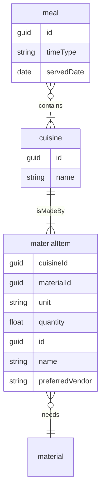

# DiffDinner
Create different meals for every family

## Entity-Relationship diagram

```mermaid
erDiagram
    cuisine ||--|{ materialItem : isMadeBy
    materialItem }o--|| material  : needs
    meal }o..|{ cuisine : contains

    meal {
        guid id
        string timeType
        date servedDate
    }
    cuisine {
        guid id
        string name
    }
    materialItem {
        guid cuisineId
        guid materialId
        string unit
        float quantity
    }
    materialItem {
        guid id
        string name
        string preferredVendor
    }
```